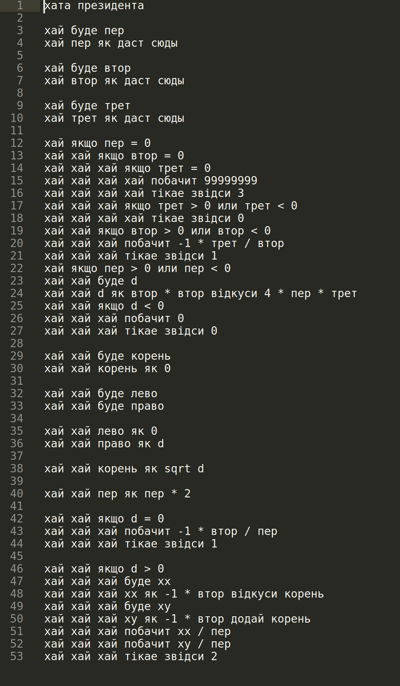

# My-compiler
***
This is my realisation of Compiler. It reads the program written in mixed Ukranian and Russian and makes an assembly code which suits [My-CPU](https://github.com/s-a-v-a-n-n-a/My-CPU).

**DESCRIPTION OF STRUCT**
------------------------
Compiler made on binary tree. Type of reading data is recursive descent.

**AN EXAMPLE OF PROGRAM**
---------------------------
I tested my program on solving square equation. That time my compiler did not have function sqrt in it so it calculates square with binary search.

***
[assembly_code_example](https://github.com/s-a-v-a-n-n-a/My-compiler/blob/main/Examples/asm.xax)
---------------------------
I'm going to develop my language compiler and make it better.

Things to do:
-----------------
* else structure
* while-else structure
